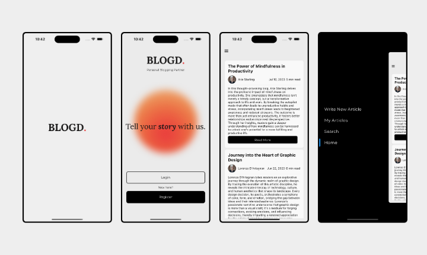

# Blog App

The Blog App is a Flutter-based application that allows users to write, publish, and read blog articles. Users can create new articles, view their own articles, and explore articles written by other users.

## Features

- User Authentication: Users can sign up and log in to access the app's features.
- Write Articles: Users can write new blog articles, add titles, authors, summaries, and content sections.
- View Own Articles: Users can view and manage articles they've written.
- Explore Articles: Users can explore a list of articles written by other users.
- Search: Users can search for articles based on keywords.
- Beautiful UI: The app features an intuitive and attractive user interface.

## Screenshots

## Demo

https://github.com/LemonLabours/BLOGD/assets/101458752/69f2dafc-c3ad-4fec-968e-33122200b99f
